# My Hero - 基础概念

* [前言](#overview)
* [基础架构](#structure)
	* [Director（导演）](#director)
	* [Scene（场景）](#scene)
	* [Layer（层）](#layer)
	* [Sprite（精灵）](#sprite)
* [分辨率适配](#resolution)
	* [从资源分辨率到设计分辨率](#res1)
	* [从设计分辨率到屏幕](#res2)
	* [两者结合](#res3)
	* [分辨率适配策略](#res4)

<h2 id="overview">前言</h2>

一方面想要实践C++，另一方面是改变自己的娱乐方式，不沉迷于打游戏，所以就有了做游戏的想法。其实这个想法已经存在很长时间了，看了一段时间书，又在网上翻各种教程，最后没坚持下来。现在大概的了解了`Cocos2d-x`，计划一边学习，一边制作一款`roguelike`游戏，这一系列文档由此而来。

其中部分图片和内容引自网络资源，在这里集中列举出来，如有遗漏，欢迎补充：

* [Cocos2d-x塔防游戏_贼来了](http://shannn.com/)
* [Cocos2d-x 3.x入门系列](http://www.jellythink.com/archives/885)
* [【官方文档】开发者指南](http://cn.cocos2d-x.org/tutorial/lists?id=105)
* [Cocos2d-x适配解决方案及原理分析](http://blog.csdn.net/u014075575/article/details/21333407)

<h2 id="structure">基础架构</h2>

在`Cocos2d-x`中，主要的概念包括`Director`、`Scene`、`Layer`和`Sprite`。它们之间的关系如下
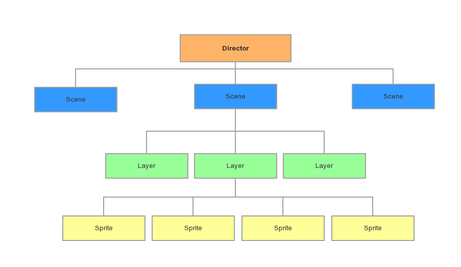

<h3 id="director">Director（导演）</h3>

Director控制着整个游戏，使用的是单例模式，整个游戏运行期间，它只有一个实例。在游戏中，一般由Director来完成以下操作的控制：

>
- OpenGL ES的初始化；
- 场景的转换；
- 游戏的暂停、继续的控制；
- 世界坐标和GL坐标之间的切换；
- 对节点的控制；
- 保存和调用保存的游戏数据；
- 屏幕尺寸的获取，等等。

<h3 id="scene">Scene（场景）</h3>

<h3 id="layer">Layer（层）</h3>

<h3 id="sprite">Sprite（精灵）</h3>

<h2 id="resolution">分辨率适配</h2>

为了能适应各种分辨率大小和屏幕宽高比的移动终端设备，就需要了解分辨率适配的原理和方法。`Cocos2d-x`图片处理有两个逻辑过程：

- 从资源分辨率到设计分辨率
- 从设计分辨率到屏幕

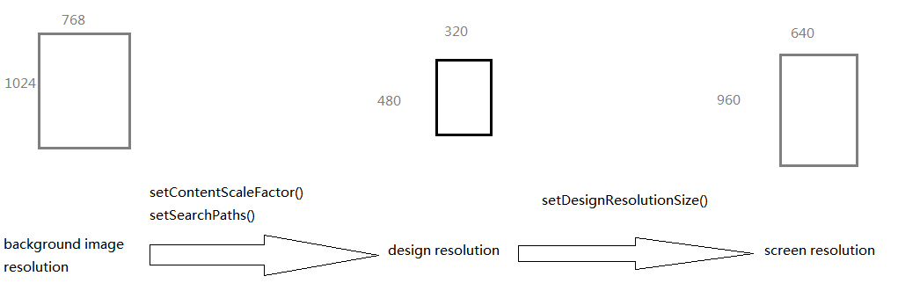

<h3 id="res1">从资源分辨率到设计分辨率</h3>

`setSearchPaths()`可以用来设定引用资源的路径，根据不同分辨率设定引用对应的图片资源即可保证完美清晰的显示。

```cpp
// set searching paths to "/mnt/sd/example" and "/data/data/org.cocos2dx.example" 
vector<string> searchPaths;
searchPaths.push_back("/mnt/sd/example");
searchPaths.push_back("/data/data/org.cocos2dx.example");
CCFileUtils::setSearchPaths(searchPaths);  
// engine will find "1.png" in /mnt/sd/example, if there it is not found, then engine will find "1.png" in /data/data/org.cocos2dx.example
// if not found, engine will find "1.png" in Resources/ (this path is platform dependent)
CCSprite *pSprite = CCSprite::create("1.png");
```

接口`setContentScaleFactor()`决定了图片资源显示到屏幕的缩放因子，它的参数由（背景图片资源宽高/设计分辨率宽高）得到，而不是通过（背景图片资源宽高/屏幕宽高）得到。这就避免了直接关注移动设备的实际屏幕

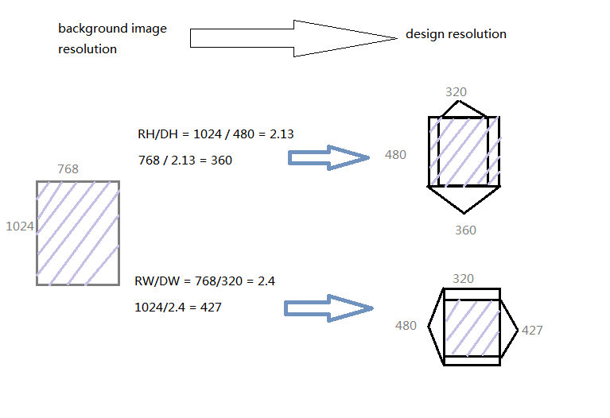

- 用高度比（RH/DH）作为缩放因子，保证了背景资源在垂直方向上全部显示，但水平方向上可能会溢出屏幕或有黑边。
- 用宽度比（RW/DW）作为缩放因子，保证了背景资源在水平方向上全部显示，但垂直方向上可能会溢出屏幕或有黑边。

<h3 id="res2">从设计分辨率到屏幕</h3>

`setDesignResolutionSize(DW, DH, resolutionPolicy)`有三个参数：设计分辨率宽、设计分辨率高、分辨率适配策略。

分辨率适配策略共有五种：
`EXACT_FIT`，`NO_BORDER`，`SHOW_ALL`，`FIXED_WIDTH`，`FIXED_HEIGHT`

- `EXACT_FIT` 整个游戏内容都会在屏幕内可见，并且不用提供比例系数。x,y会被拉伸，使内容铺满屏幕，所以可能会出现形变，所有的应用程序看起来可能会是拉伸或者压缩的。
- `NO_BORDER` 一个方向铺满屏幕，另外一个方向超出屏幕，不会变形，但是可能有一些裁剪。
- `SHOW_ALL` 该模式会尽可能按原始宽高比放大游戏世界，同时使得游戏内容全部可见。内容不会形变，不过可能会出现两条黑边，即屏幕中会有留白。
- `FIXED_WIDTH` 该模式会横向放大游戏世界内的内容以适应屏幕的宽度，纵向按原始宽高比放大。
- `FIXED_HEIGHT` 与上一中模式相反。

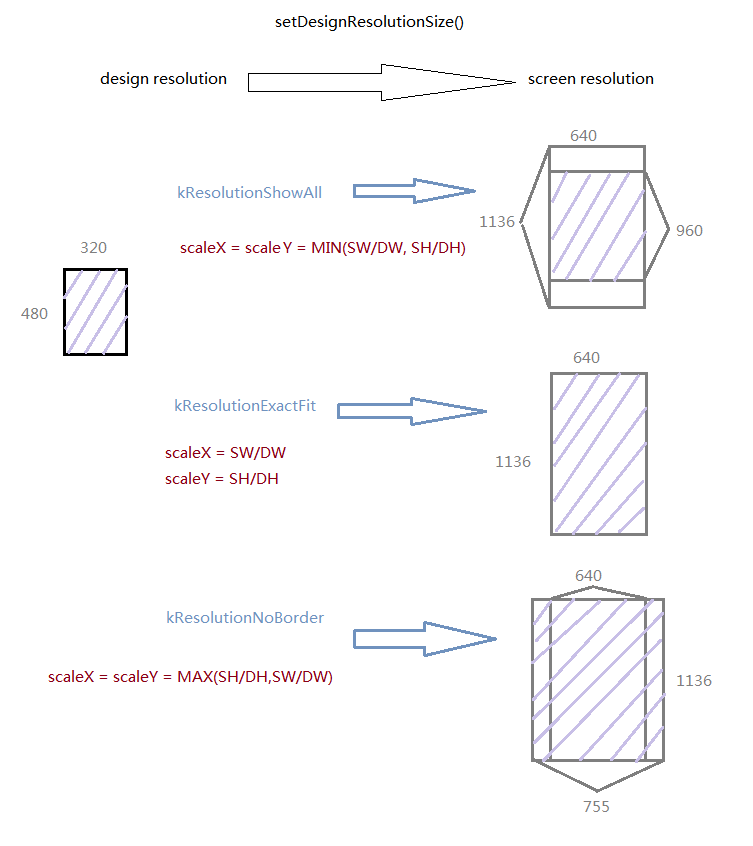
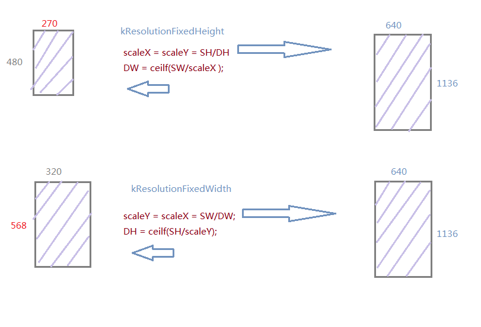
图中名称为旧版名称

<h3 id="res3">两者结合</h3>

最常见有两种选择：

- `setContentScaleFactor(RH/DH)`与`FIXED_HEIGHT`结合

	> 适应于高方向全部显示，宽方向可以裁剪的游戏
	

- `setContentScaleFactor(RW/DW)`与`FIXED_WIDTH`结合

	> 适应于宽方向全部显示，高方向可以裁剪的游戏

<h3 id="res4">分辨率适配策略</h3>

前面已经提到`Cocos2d-x`目前提供了五种适配策略，这里再进一步深入探讨一下。

首先，我们需要了解这样几个概念：`frameSize`、 `winSize`、`visibleSize`, `visibleOrigin`

- `frameSize`指的是设备尺寸，例如iphone6就是1334x750
- `winSize`是设计游戏的基础尺寸，引擎会根据当前设备的分辨率计算一个缩放比，然后用这个尺寸乘以缩放比，得到真实的游戏界面的窗口大小
- `visibleSize`是能看到的游戏界面的尺寸，这个游戏界面指的是我们设计的winSize
- `visibleOrigin`是这个可见尺寸的左下角

下面是设置适配类型的关键代码：

```cpp
    auto director = Director::getInstance();
    auto glview = director->getOpenGLView();
    glview->setDesignResolutionSize(480, 320, ResolutionPolicy::EXACT_FIT);
```
`setDesignResolutionSize`是设置适配模式的函数，前面两个参数传递的是`winSize`的尺寸，第三个参数传递的是适配模式类型。

<h4 id="res4_1">EXACT_FIT</h4>

`EXACT_FIT`直接把我们给定的`winSize`拉伸到和设备屏幕一样大小，在缩放过程中长和宽的缩放比是不一样的。

下面给出一个例子，图片资源是480x320，而设备屏幕是1334x750，设计分辨率设置为480x320，之后的模式也采用同样的参数。
因为设计分辨率与图片分辨率是一样的，所以不需要考虑从图片资源到设计分辨率的过程，只需要考虑设计分辨率到屏幕分辨率的过程。

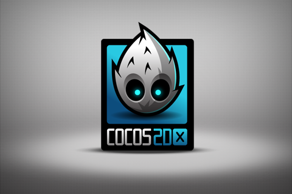

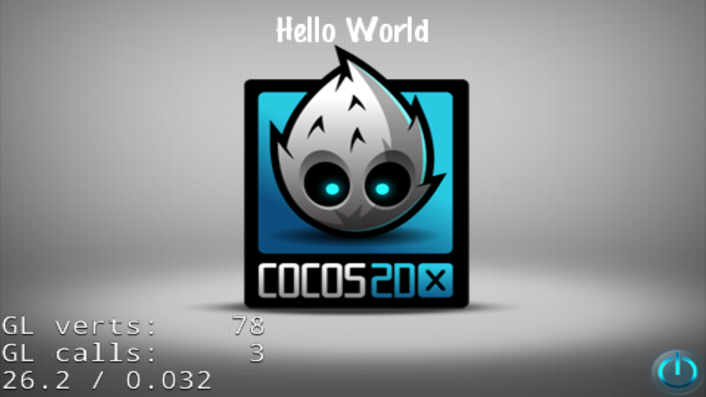

上面第一张图是原始图片，如果设备屏幕是960x640的话，就会2倍等比例缩放，不会发生变形。但是，因为现在设备是1334x750,

```python
>>> 1334/480
2.779166666666667
>>> 750/320
2.34375
```

这不是一个等比例缩放，水平方向要比垂直方向大，也就是说图片被压扁了，从图中也可以看到这种情况。市场上的设备分辨率实在太多，
我们不可能为为每一个分辨率设置一个等比例的设计分辨率，所以这个模式并不是很好。

<h4 id="res4_2">SHOW_ALL, NO_BORDER</h4>

因为`SHOW_ALL`和`NO_BORDER`是两个相对的模式，所以放在一起讲。他们都保证了等比缩放，也就是说水平和垂直方向上的缩放
是一致的。不同点在于，`SHOW_ALL`是按照较小的那个缩放比来进行缩放，而`NO_BORDER`是按照较大的那个。还是上面那个例子，
对于`SHOW_ALL`来说，缩放比就是2.34375；而对于`NO_BORDER`则是2.7917。

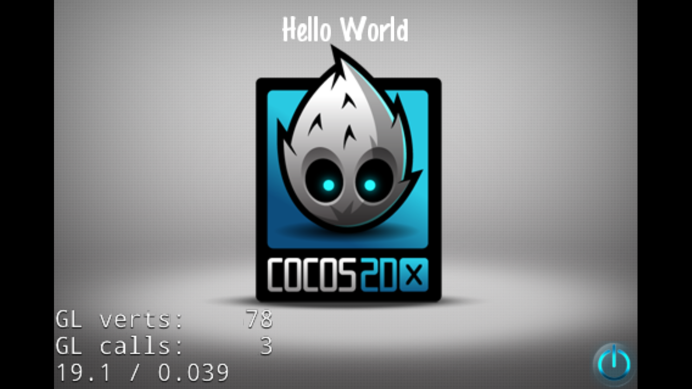

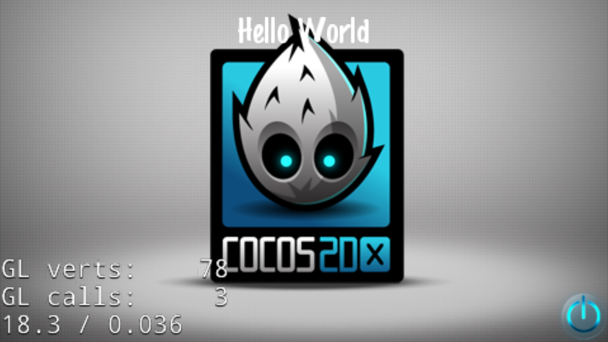

第一张图中，因为采用较小的缩放比（这里即高度比），在水平方向上放大的不够，所以显示出来的游戏界面左右两边有黑边。而第二张图
中，helloworld这个label已经与logo有部分重合，这是因为图片在垂直方向缩放了太大，超出了屏幕。

在继续讲剩下的两种模式之前，先来看下`setDesignResolutionSize`代码

```cpp

void GLView::updateDesignResolutionSize()
{
    if (_screenSize.width > 0 && _screenSize.height > 0
        && _designResolutionSize.width > 0 && _designResolutionSize.height > 0)
    {
        _scaleX = (float)_screenSize.width / _designResolutionSize.width;
        _scaleY = (float)_screenSize.height / _designResolutionSize.height;
        
        if (_resolutionPolicy == ResolutionPolicy::NO_BORDER)
        {
            _scaleX = _scaleY = MAX(_scaleX, _scaleY);
        }
        
        else if (_resolutionPolicy == ResolutionPolicy::SHOW_ALL)
        {
            _scaleX = _scaleY = MIN(_scaleX, _scaleY);
        }
        
        else if ( _resolutionPolicy == ResolutionPolicy::FIXED_HEIGHT) {
            _scaleX = _scaleY;
            _designResolutionSize.width = ceilf(_screenSize.width/_scaleX);
        }
        
        else if ( _resolutionPolicy == ResolutionPolicy::FIXED_WIDTH) {
            _scaleY = _scaleX;
            _designResolutionSize.height = ceilf(_screenSize.height/_scaleY);
        }
        
        // calculate the rect of viewport
        float viewPortW = _designResolutionSize.width * _scaleX;
        float viewPortH = _designResolutionSize.height * _scaleY;
        
        _viewPortRect.setRect((_screenSize.width - viewPortW) / 2, (_screenSize.height - viewPortH) / 2, viewPortW, viewPortH);
        
        // reset director's member variables to fit visible rect
        auto director = Director::getInstance();
        director->_winSizeInPoints = getDesignResolutionSize();
        director->createStatsLabel();
        director->setGLDefaultValues();
    }
}
```

前面三种模式都可以很清楚的在代码中找到，`EXACT_FIT`是分别乘以各自的缩放比，另外两个是分别乘以最大缩放比和最小缩放比。
`viewport`是OpenGL需要渲染的窗口大小，是一个设备端的概念。
对于`EXACT_FIT`来说，渲染窗口与屏幕窗口大小一致，`SHOW_ALL`是少了一块，所以
有黑边，而`NO_BORDER`则会超出，浪费了一些。这里的黑边不能再填充

<h4 id="res4_3">FIXED_HEIGHT, FIXED_WIDTH</h4>

从代码中看到，当选择`FIXED_HEIGHT`时，它会把`winSize`的宽度重新计算；当选择`FIXED_WIDTH`时，它会把`winSize`
的高度重新计算。也就是说，**setDesignResolutionSize函数传入的前两个参数并不一定就是程序最后的winSize大小！
在FixedHeight和FixedWidth模式下，引擎分别重新计算了它的宽和高！**

这样做的目的是什么呢？别忘了最后`viewport`的计算，现在通过修改了`winSize`的宽或高，使得`viewport`的大小与屏幕大小相同，
所以说，在这两种模式下，既填满了整个屏幕且没有浪费，又是等比例缩放。需要注意的是，虽然渲染窗口与屏幕窗口大小一致，但因为
图片某个方向不够，也会有黑边的存在，这里的黑边是可以覆盖的。

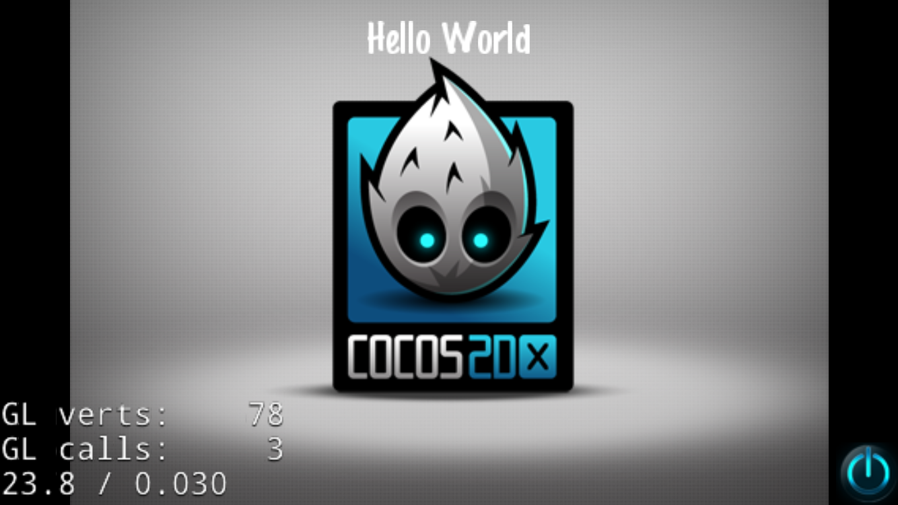

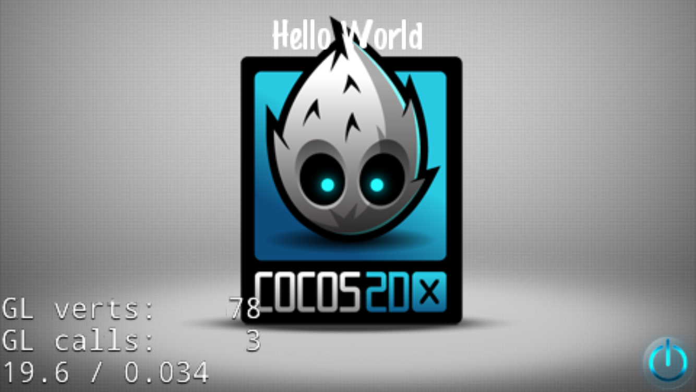

第一张图是`FIXED_HEIGHT`，而第二张图是`FIXED_WIDTH`。注意到第一张图右下角的终止图标是在黑色区域，也就是说这时候的
黑色区域仍然是被渲染的，只是没有图片覆盖而已。

<h4 id="res4_4">visibleSize, visibleOrigin</h4>

最后来谈下`visibleSize`和`visibleOrigin`

```cpp
Size Director::getVisibleSize() const
{
    if (_openGLView)
    {
        return _openGLView->getVisibleSize();
    }
    else
    {
        return Size::ZERO;
    }
}
```

```cpp
Size GLView::getVisibleSize() const
{
    if (_resolutionPolicy == ResolutionPolicy::NO_BORDER)
    {
        return Size(_screenSize.width/_scaleX, _screenSize.height/_scaleY);
    }
    else 
    {
        return _designResolutionSize;
    }
}
```

除了`NO_BORDER`以外，其他模式下`viewport`都是在屏幕内，都是能看全的，所以`visibleSize`
和`winSize`大小是一样的。而`NO_BORDER`下，设备端下`viewport`是大于或等于屏幕的，设计端
`winSize`大于`viewSize`，这时候，要想求出`viewSize`只要把屏幕尺寸通过缩放回到设计端。

当然，`NO_BORDER`下，`viewOrigin`也需要重新计算，因为这个原点只是屏幕零点投影回设计端
的位置。而坐标原点是在`winSize`下的。